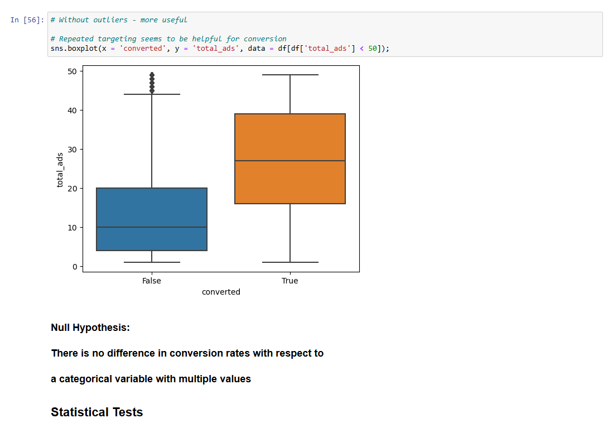

## Hands-on Marketing A/B Testing with Python

Performed univariate and bivariate analyses and Chi-square, Shapiro-Wilk, Levene, and Mann-Whitney U tests to check the null hypothesis: There is no difference in conversion rates for a categorical variable with multiple values.

As a result, the null hypothesis is rejected with the following results:

- Showing the ads makes a positive difference
- Which days and hours to show the ads also make sense
- The higher the median amount of total ads people see, the greater the conversion.
- Repeated targeting seems to be helpful for better conversion

Reference [video](https://www.youtube.com/watch?v=AQC7b68H7LU/t=0)
